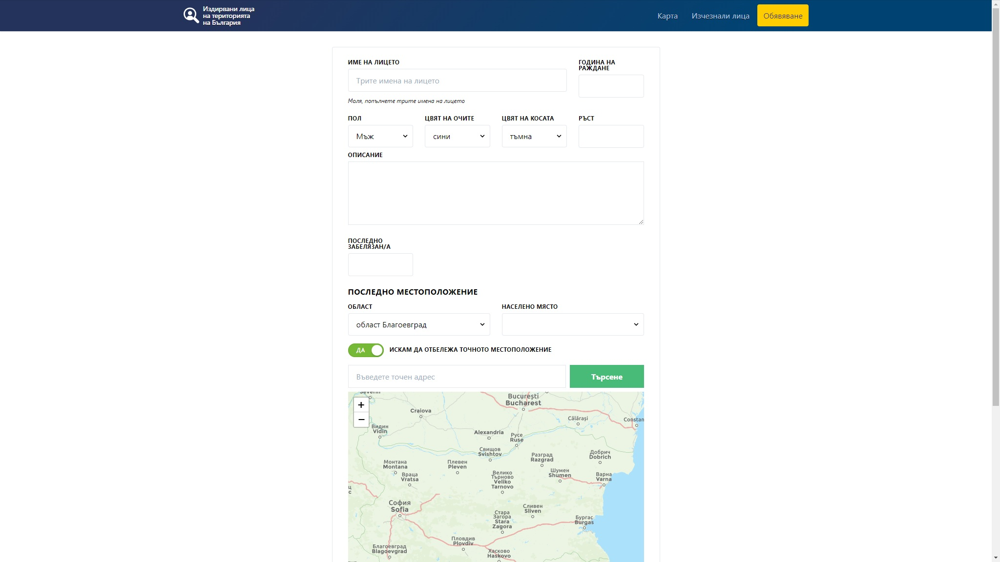
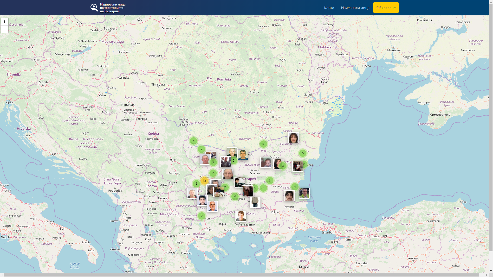

# "Missing/Wanted persons" Laravel package

## Why this package was made?
In 2019, while other countries are building and sending satellites in The Space, Bulgaria (member of EU since 2007) doesn't have even simple database for missing/wanted people.

No one institution can give an exact answer to how many people have disappeared and they are still missing.

As a result of the soullessness, illiteracy, incompetence and lack of interest of the Bulgarian state institutions, hundreds of Bulgarians have been searching for their missing elderly parents for years, which could have been detected in a timely and adequate response.

			
Some of these people **are missing more than 20 years** and their families still have a hope someday they will come back.
			
Anyone can imagine what it feels like to know that your mother, father or your grandparent is alone outside without being able to find out where she/he is and how to go home.
			
Dozens or hundreds of people with convictions, including serious crimes such as murder, live quietly in Bulgarian cities and villages.
This happens because by the law, they should be searched on their official address.

			
All this things are pushing the people to use their own ways to find the missing persons - creating special pages in the social medias, searching of CCTV recordings, sending appeals to TVs.
			
This package is just one more way to help searching of missing/wanted person.

